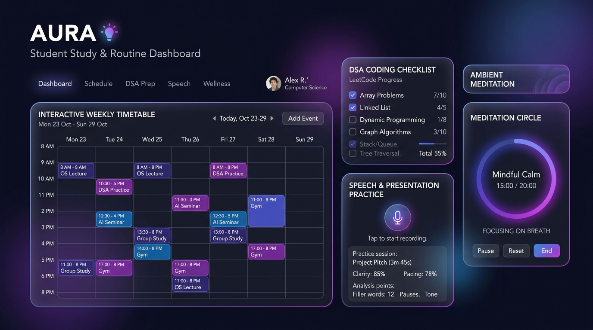

# ⚡ AURA — Personal Growth & 7th Semester Academic Routine Tracker

[](https://abhishekh002.github.io/routine-tracker/)
[](https://abhishekh002.github.io/routine-tracker/)
[-8b5cf6?style=for-the-badge)](https://abhishekh002.github.io/routine-tracker/)

---

## 📸 App Interface Preview



> 🚀 **Live PWA Link**: [https://abhishekh002.github.io/routine-tracker/](https://abhishekh002.github.io/routine-tracker/)

---

## 📌 Features & Architecture

- **Zero-Framework Architecture**: Built with pure ES6+ JavaScript, HTML5, and CSS3 with HSL dark-glassmorphism.
- **7th Semester (Batch B2) Tailored Schedule**:
  - `B-SPP-SKS` (System Prototyping Program)
  - `AAE-DM` (Advanced Antenna Engineering)
  - 2 Open Elective Online Course Blocks
  - AI/ML Specialization Online Course & Hands-on Project Blocks
  - `B2-PPD-II-ALL` Project Lab (Thu 3:00 PM – 5:00 PM)
  - `B2-SIRE-II-SM, SS` Seminar Lab (Fri 3:00 PM – 5:00 PM)
- **7-Day Routine Support**: Full schedule coverage for Monday through Sunday (Weekdays + Weekend Deep Work).
- **Skill-Building Hubs**:
  - 💻 **Coding & DSA Mastery**: Topic-based problem checklists (Arrays, Two Pointers, Stacks, Trees, DP) with difficulty badges.
  - 🗣️ **English Communication Hub**: Topic speech prompts, Web Speech API speech-to-text recorder, and shadow reading passages.
  - 🧘 **Zen Space**: Configurable meditation timer with an animated breathing guide circle and Web Audio API 136.1 Hz audio synth.
- **Mobile Native PWA Integration**:
  - Mobile bottom app navigation bar.
  - Custom `beforeinstallprompt` header button.
  - Service Worker (`sw.js`) with a Stale-While-Revalidate caching strategy.
  - Automatic update detection toast.
  - Native Web Share API integration (`navigator.share`).
- **Data Integrity & Offline Persistence**:
  - Schema-validated JSON backup export & import (`aura_routine_backup_YYYY-MM-DD.json`).

---

## 🛠️ Project File Structure

```
routine-tracker/
├── index.html                # Bundled self-contained web app
├── style.css                 # Modern glassmorphism stylesheet & mobile system
├── app.js                    # Timetable state management & core logic
├── manifest.json             # PWA manifest specification
├── sw.js                     # Service Worker for offline asset caching
├── aura_dashboard_preview.jpg# UI Preview screenshot
└── .github/workflows/        # Automated CI/CD deployment workflow
```

---

## 📱 Mobile Installation Guide

1. Open **[https://abhishekh002.github.io/routine-tracker/](https://abhishekh002.github.io/routine-tracker/)** on your phone.
2. Tap **"Add to Home screen"** or the in-app **"📲 Install App"** button.
3. Enjoy your 7th Sem Batch B2 app directly from your mobile home screen!
